# GolfGate

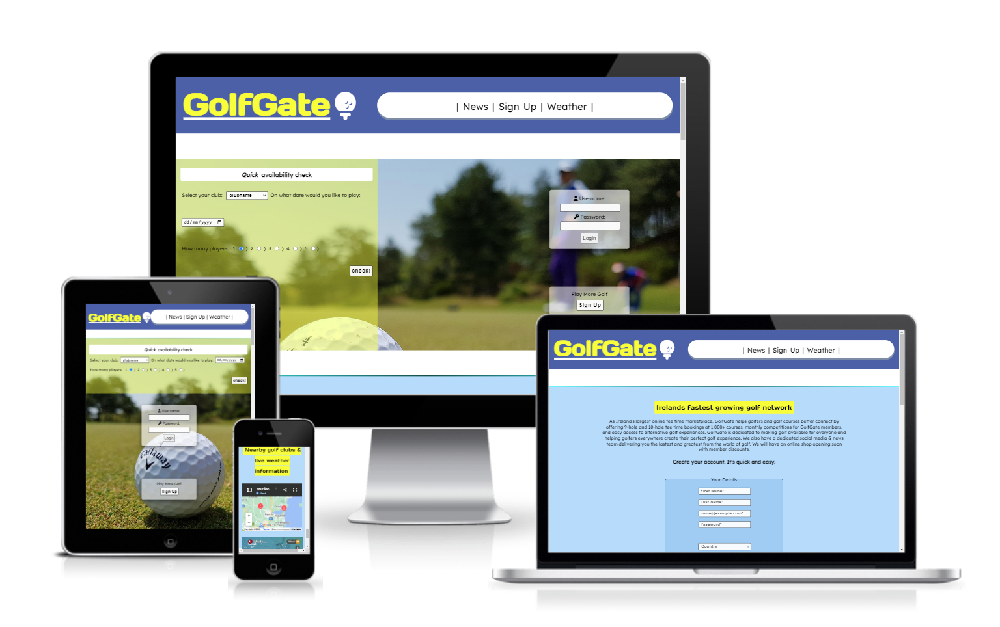

[View GolfGate on Github Pages](https://ian-garrigan.github.io/Milestone-Project-1/)

------------


------------
Golfgate is a website designed and targeted towards every type of golfer young and old. It allows them to take advantage of particapating golf clubs within there community that utilize our proprietary booking, results, news and weather services.  Specially managed tee times and discounts are allocated only for users who have signed up to GolfGate. We will ensure that our loyal members will always experience swift hassle-free golf days out with passionate and like minded individuals. Golfgate allows the user to make plannning there next round of golf easy especially during the busy summer season.   

Golfgate's website features a quick round interaction box on the home landing page which allows users to instantly search for any available tee times on their desired date. It features a swift login access form for frequent users and a create account button for those who want to get involved. News and golfgates daily publication of inspirational quotes adds sentimental value and ensures our golfers remain in love with the game. Welcome.

------------

## Design

### Colour Scheme

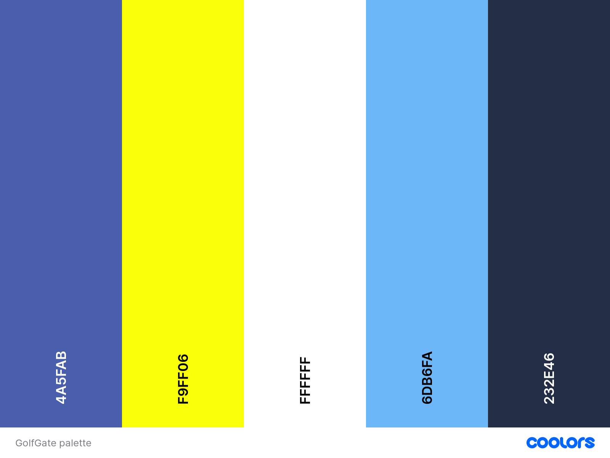

The website uses a palette of vibrant and cool colours that create a sporty feel often seen used in golfing products such as driver head covers and golf balls. Its color design is robust and very easy to read allowing the user to differentiate quickly between points on the screen. The colour palette was created using the [Coolors](https://coolors.co/) website.

### Typography

[Google Fonts](https://fonts.google.com/) was used for the following fonts:

* Days One is used for headings on the site. Letterforms are wide, and the strokes are thick. This makes Days One good for headlines.

* Lexend Deca is used for the body text on the site. Lexend is a collection of seven font families intended to improve reading proficiency.

### Imagery

I carefully selected golfing related images for all of the sites pages. A close up shot of a pure white golf ball shining in the sun evokes good memories for every golfer patiently waiting to get through the bad winter season. My sporty color theme and simple imagery of green grass and white coated golf ball pair well throughout the site. One image in particular lets the user imagine the ball will roll into the hole and score a point while they recieve a successful check on tee time available to book. 

### Wireframes

Early at the begining of my project i used the [Balsamiq](https://balsamiq.com/) wireframing application to help me visualise the foundation and scope of the website. I orignally intended for the company to be named GolfHub but soon scraped this idea because i thought golfgate sounded more welcoming.  
### Desktop Sketch

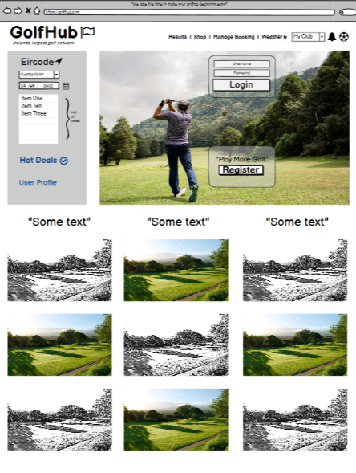

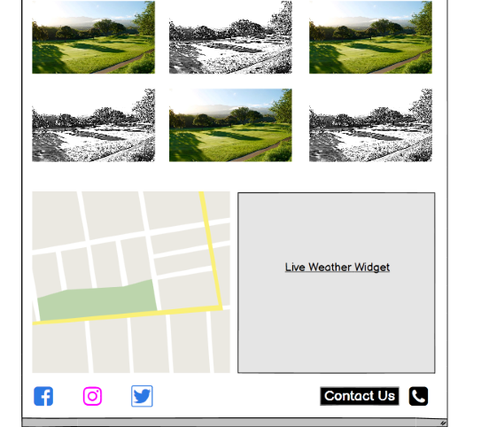

------------
## Features 

The website is comprised of 3 pages. Each page features all of the same header and footer elements for ease of use.

### Existing Features

- __Navigation Bar__

  - A responsive header allows users to navigate the site by using the larger the most links you see on most websites in the world today. I liked the idea of bigger font size and wrapped nicely in a cylindrical shaped border containing them. The curves co-exisit beside the sites golf ball icon. 

  - The navigational header is not stuck to the top of the page by design choice i think it allows the page to stand out more in full view when each section is scrolled upon. 

  - The websites logo and golf ball icon to the left of the header conveniently bring the user to the homepage if clicked on. This allows easy navigation for the user, making the back button redundant. 


- __The landing page image__

  - I picked a dream like landing page image that was a blurred close up lens shot, this can create an aspect of excitement and an eagerness to get out and play. At the same time its subtle enough not to be a distraction to the sites interactive elements. 

  - This section is nicely split into two halves with the quick round checker highlighted in an opaque yellow on the left and the user login & register button offset to the right.  

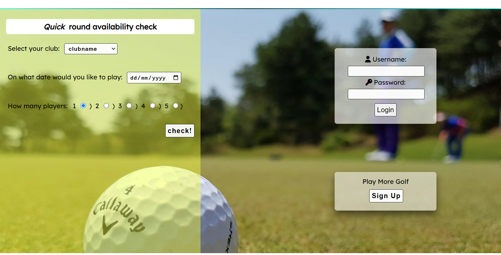

- __Inspirational quotes section__

  - The daily dose of Inspirational quotes section will be golfgates way of keeping in touch with its social side of things. This section will feature daily changes citing some of the most reknowned golfers to grace the game. Users who read it will derive a new sense of meaning of the sport.They will carry on as motivated and inspired as ever. Im sure this section will serve its purpose well.  

  - This section acts as a nice seperation from the landing page and flows well horizonatally across the page on desktop and the vertically for smaller devices.

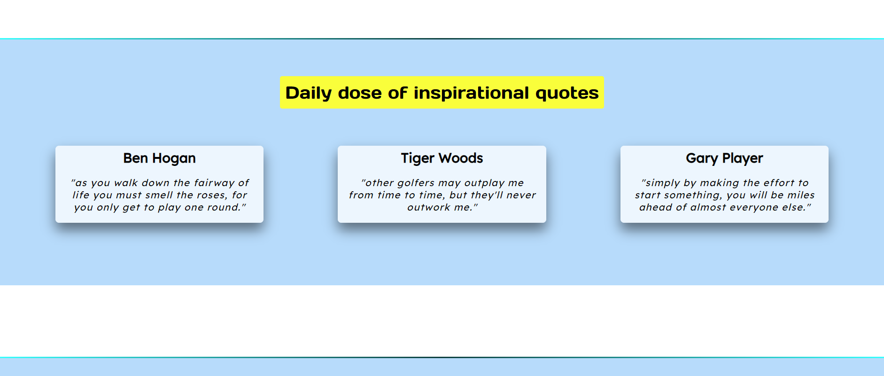

- __Golf courses left available for today section__

  - This section will allow the user to see which golf courses are available only for the particular day they are currently at. This is a nice overview of what can be offered on short notice with no prior booking.
  - This section will be updated by the golfgate team and rotated and displayed in line with the demand for each club on any given day.  

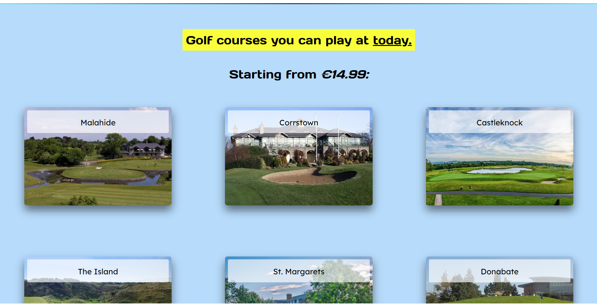

- __The News Section__ 

  - Golfgate will publish a news article curated for the golfing communitys interest and any talking points within the world of golf. This will keep our up to date and on our site for a longer time hopefully holding on to any traffic for advertisers to benefit from.
  - The article is clearly disguinsable within the section and an embedded video allows the user to play media in relation to the topical newsletter. 

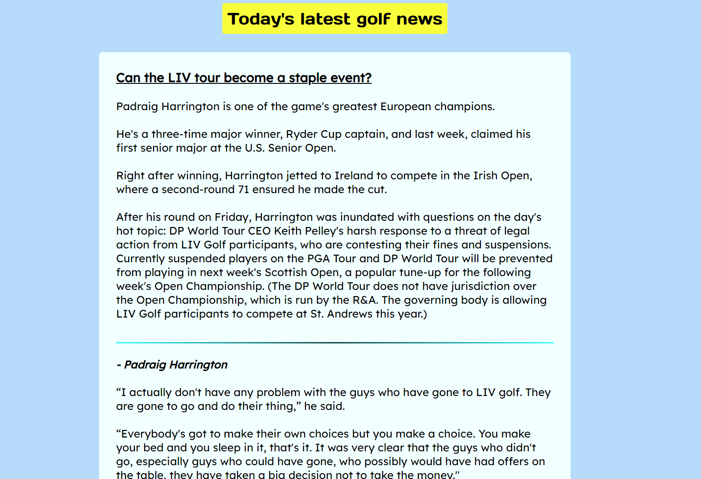

- __Live weather widget and google map__

  - The Live weather widget and google map will provide the user with real time wind and rain conditions [Windy](https://www.windy.com/?53.350,-7.152,7) along with an accompanying google map pin pointing each of the club houses in the area. This map is marked specifically for golfgates purposes.  
  - This section is valuable to the user as they will have a much better judgement of what conditions are on offer. They can take this into consideration when deciding what clothes to wear or how the ball will behave while flying through the sky.

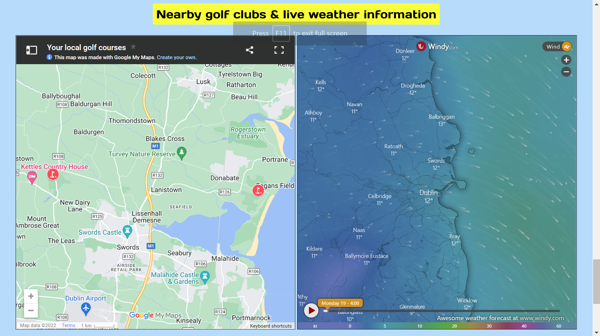

- __The Footer__

  - The footer is designed to be simple and both the connect with us and email/phone text is marked clearly with the websites reoccuring shade of yellow. 
  - The footer uses the social media icons from [Font Awesome](https://fontawesome.com/) The styles i picked were used to keep the footer clean and compact. 


- __The Create your Account Page__

  - This page is quick and easy to navigate. The sign up form features a stacked input design with placeholder text. I did not forget to make this form accessable for screen readers as i added suitable labels for each input and used css code to hide the labels visually for a sleeker design that fits brilliantly to all screen sizes. 

  #### Mobile Device

  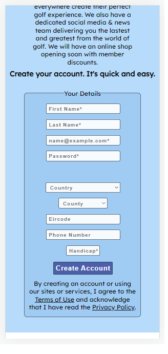

## Technologies Used

### Languages Used

HTML and CSS were used to create this website.

### Libraries & Programs Used

Balsamiq - Used to create rough sketch wireframes.

Git - For version control.

Github - To save, store the files and deploy the website.

FontAwesome - Used as a link and source for icons displayed on site.

Google Fonts - Used to import the two fonts used for the website.

Pixabay - Used to source copyright free images 

Gitpod - Used as the interactive development environment (IDE) for the project.


### Accessibility

To achieve a friendly and accessable website to all i abided by some coding rules to help attain this.

* Semantic tags used throughout each page. 
* Using aria labels when appropriate. For images on my index.html i had to deploy this through the use of a span tag inside the div which held the css background-image. I will reference the code which helped me do this below. 
* Ensuring that there is a sufficient colour contrast that scored high in lighthouse. 
* Ensuring menus are accessible by marking the current page as aria-current=true for screen readers.

### Features Left to Implement

- Introduce an online shop with python and javascript functions allowing the easy sale of second hand golf equipment dropped off to us by our members. The market for second hand golf clubs is enormous. 

- Monthly competitions with valueable prizes on offer can be helped by a donations form on our website along with a results page outlining the final scores table.

-Javascript for a go to top of page button would be a future implementation and a hamburger menu for mobiles.

## Testing 

- Testing was ongoing throughout the entire build. I became very familair with my Chrome developer tools while building and troubleshooting any issues as I went along. It helped me a lot to try out new pieces of code at troublesome areas where my responsive values did not behave as i wished. 

The following issues were raised during my mid project meeting with my mentor:

- The bottom scrollbar was on because i had an issue with my margin sizes on the landing page and iframe elements spilling out horizontally. I had to resolve the issue by implementing better responsive values em or % percentages and carefully use my dev tools to rewrite code. 

- My form closing tag part of the yellow interaction box was situated on the incorrect line, it also lacked the designated action value and i turned on the required attribute. 

- Old frameborder styling on my iframes was not necessary.

- I tested the lazy loaded attribute on the embedded video and the lighthouse score increased. This opportunity was pointed out to me by lighthouse itself along with other steps i could take like converting my jpg files to webp. Results shown here:


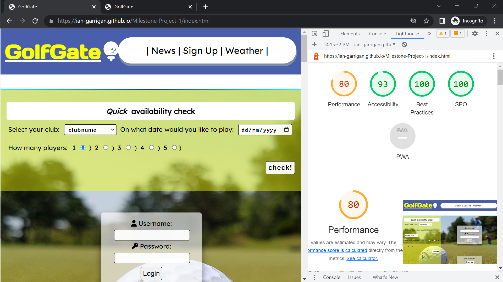

 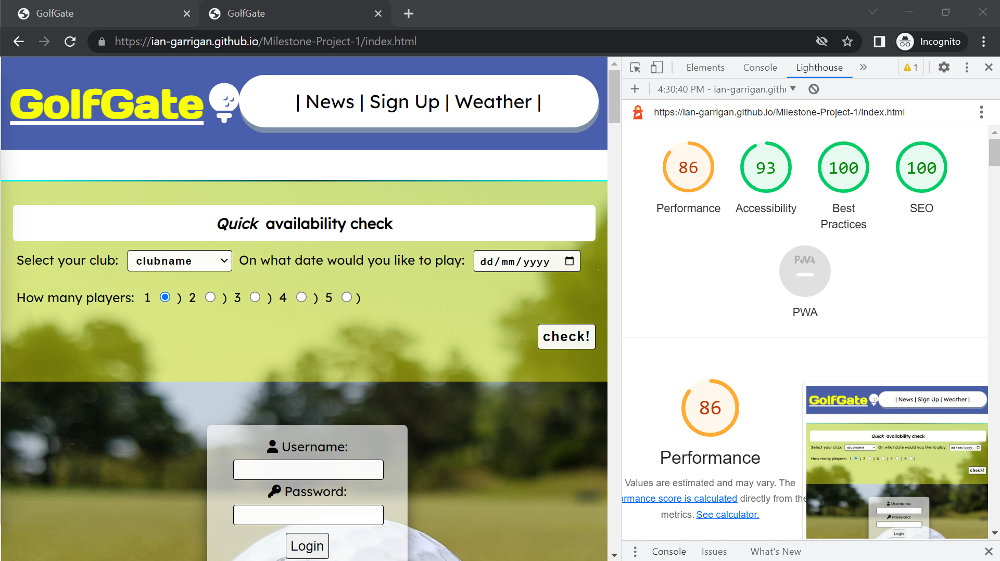

- I tested the responsiveness by slowly shrinking my browser window and keeping an eye on the pixel width count, if i noticed a bad break in the pages fluidity i inspected the area and made media queries for that specific pixel width. I began by observing each of my pages from top to bottom. Fixing any messy unresponsive and then adding the new code i thought preformed better to the related directory with the file in gitpod. 

- I tested the website on the samsung galaxy S8+, S9+, S20 Ultra, Google Pixel 5, iPhone SE, iPhone XR, iPhone 12 Pro, OnePlus Nord, iPad Air and iPad Mini. The performance for each device was more than good and i was happy with my media queries.


### Validator Testing 

-  No errors were returned when passing through the official HTML W3C validator.
-Screenshots
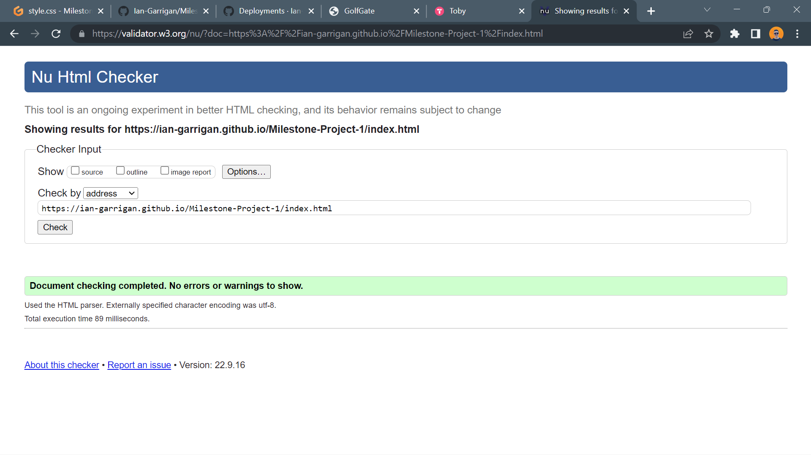

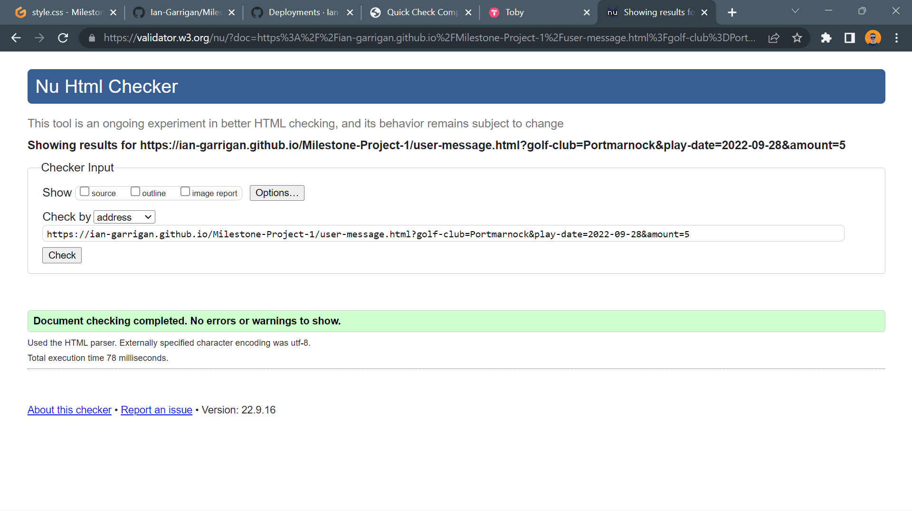
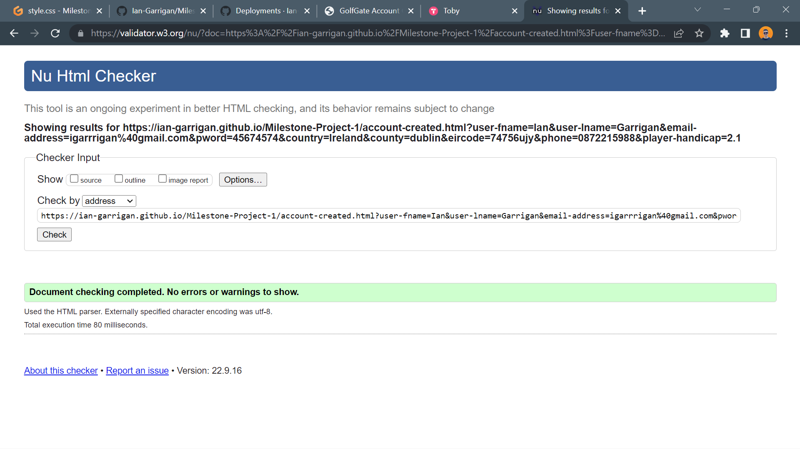


-  No errors were found when passing through the official Jigsaw CSS validator. 
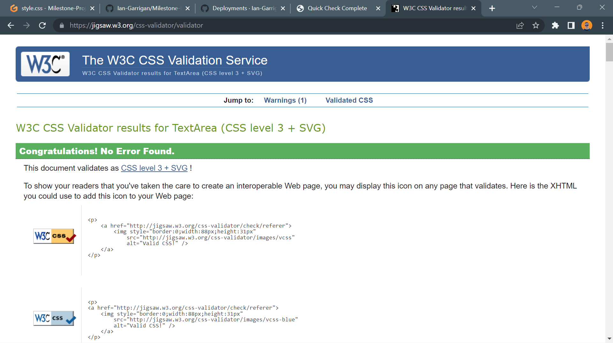

### Unfixed Bugs
I did not find any bugs in the website from time of writing. I can only say that on one particular device my friend owns he pointed out to me that header navigation link wrapper was touching the h1 icon to the left. I also could fix the footer to allow more room for extra information and content. 

## Deployment

The site was deployed to GitHub pages. The steps to deploy are as follows: 
  - In the [GitHub repository](https://github.com/Ian-Garrigan/Milestone-Project-1), navigate to the Settings tab 
  - From the source section drop-down menu, select the **Main** Branch, then click "Save".
  - The page will be automatically refreshed with a detailed ribbon display to indicate the successful deployment.

The live link can be found [here](https://ian-garrigan.github.io/Milestone-Project-1/)

### Local Deployment

In order to make a local copy of this project, you can clone it. In your IDE Terminal, type the following command to clone my repository:

- `git clone https://github.com/Ian-Garrigan/Milestone-Project-1.git`

Alternatively, if using Gitpod, you can click below to create your own workspace using this repository.

[](https://gitpod.io/#https://github.com/Ian-Garrigan/Milestone-Project-1)


## Credits 

-(http://www.davidmacd.com/blog/alternate-text-for-css-background-images.html)
What if the author has to have a CSS image on a div that contains content
Sometimes there are dependencies in the CSS stack and messing with it can cause upset the design and layout of the site, or a request to change the code could get hung up in approval from various stakeholders. In cases where the author has to have the background image in the div that wraps up other content, then a hacky fallback is to do this.

```html
<div class="background-image">
  <span role="img" aria-label="[place alt text here]></span>
</div>
```

https://developer.mozilla.org/en-US/docs/Web/CSS/gradient/linear-gradient i learnt how to style my horizonatl ruler with a unique aqua navy blue linear gradient should look here.

### Content 

- The icons in the footer were taken from [Font Awesome](https://fontawesome.com/)
- News Article content here: (https://golf.com/news/padraig-harrington-weighs-in-liv-golf-defectors/)

### Media

- The photos used on the home and sign up page are from [Pexels](https://www.pexels.com/) open source site.
- The images used for the landing page were from [Pixabay](https://pixabay.com/). 
- I used google images to require images of golf clubs already in circulation for viewing purposes
